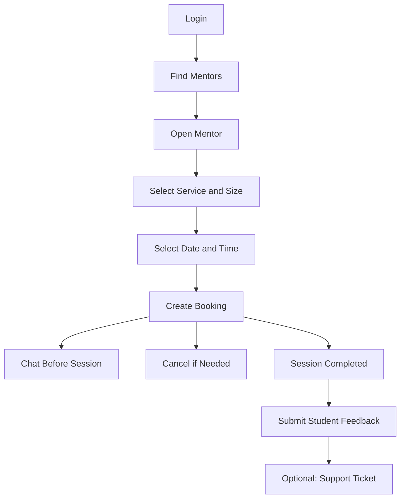
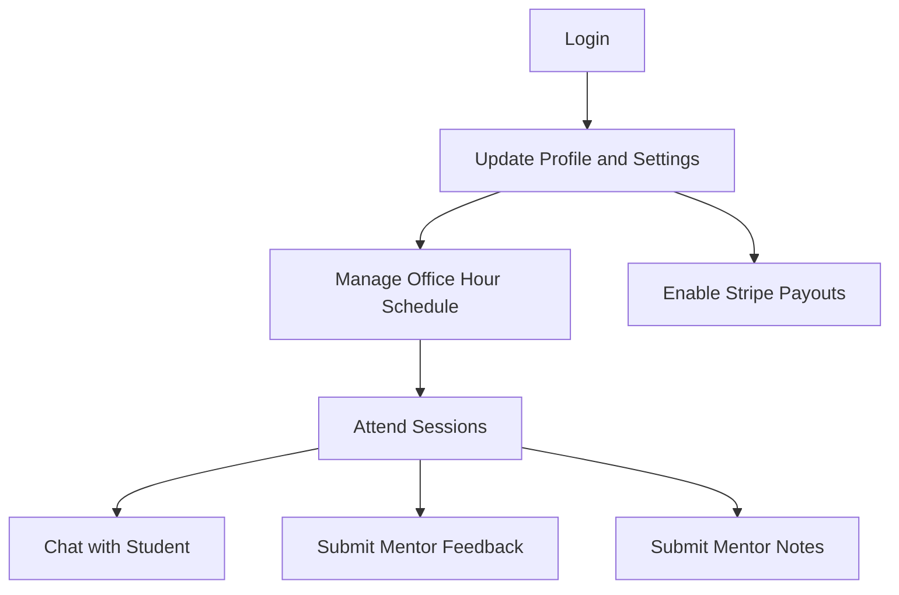
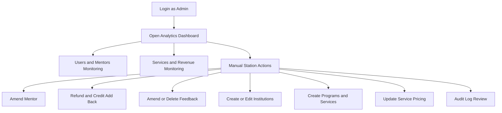

# Grads Paths Role Flow Execution Blueprint

Date: 2026-04-10
Scope: End-to-end operational flows for Admin, Student, Mentor.
Input sources used: UI templates in gradspath-dashboard-main and schema in Grad paths migrations.

## 1) Access Model

## Roles

- Student
- Mentor
- Admin

## RBAC expectation

- Role assignment via Spatie tables: roles, permissions, model_has_roles, model_has_permissions, role_has_permissions.
- Every protected endpoint checks auth + permission.

## Core permission groups

- discovery.read
- booking.create
- booking.cancel
- feedback.create
- mentor_feedback.create
- mentor_notes.manage_own
- mentor_profile.manage_own
- support.create
- support.read_own
- admin.analytics.read
- admin.manual.manage
- admin.feedback.moderate
- admin.institutions.manage
- admin.pricing.manage
- admin.logs.read

## 2) Student Flow

## Flow diagram

## Step-by-step execution

1. Login

- Endpoint: POST /api/v1/auth/login
- Tables: users, oauth_tokens (if social)
- Checks: account active, credentials valid
- Failure cases:
    - invalid credentials -> 401
    - inactive user -> 403

2. Discover mentors

- Endpoints:
    - GET /api/v1/mentors/featured
    - GET /api/v1/mentors
    - GET /api/v1/universities
- Tables: mentors, mentor_services, services_config, feedback, mentor_ratings, universities
- Checks: discovery.read

3. Open mentor and select offering

- Endpoint: GET /api/v1/mentors/{id}
- Tables: mentors, mentor_services, services_config, office_hour_schedules
- Checks: discovery.read

4. Select slot and create booking

- Endpoints:
    - GET /api/v1/mentors/{id}/availability
    - POST /api/v1/bookings
- Tables touched on success:
    - bookings (insert)
    - office_hour_sessions (occupancy updates for office-hours)
    - user_credits (decrement)
    - credit_transactions (insert deduction)
- Required checks:
    - booking.create
    - available slot
    - sufficient credits
    - office-hours lock/cutoff rules
- Atomic transaction required: booking + credit update + ledger write
- Failure cases:
    - insufficient credits -> 422
    - slot already taken/full -> 409
    - invalid office-hour session state -> 422

5. Pre-session chat

- Endpoints:
    - GET /api/v1/bookings/{id}/chat
    - POST /api/v1/bookings/{id}/chat/messages
- Tables: chats, bookings
- Checks:
    - user must be booking participant
    - chat window policy (for example 48h before session)

6. Cancel booking

- Endpoint: POST /api/v1/bookings/{id}/cancel
- Tables:
    - bookings (status + cancelled_at + cancelled_by)
    - user_credits (refund increment)
    - credit_transactions (refund row)
- Checks:
    - booking.cancel
    - policy window for refund eligibility
- Atomic transaction required

7. Submit student feedback

- Endpoint: POST /api/v1/bookings/{id}/feedback
- Tables: feedback, mentor_ratings (recompute job), bookings (feedback flags)
- Checks:
    - booking status must be completed
    - unique feedback per booking_id + student_id
- Failure cases:
    - not completed -> 422
    - duplicate feedback -> 409

8. Submit support ticket

- Endpoint: POST /api/v1/support/tickets
- Tables: support_tickets
- Checks: support.create, rate limit, sanitization

## Student statuses used

- bookings.status: pending, confirmed, completed, cancelled, cancelled_pending_refund, no_show
- support_tickets.status: open, in_progress, resolved, closed

## 3) Mentor Flow

## Flow diagram

## Step-by-step execution

1. Mentor authentication and role gate

- Endpoints: POST /api/v1/auth/login, GET /api/v1/me
- Tables: users, roles mapping tables
- Checks: mentor role assigned

2. Manage profile

- Endpoints:
    - GET /api/v1/mentor/profile
    - PATCH /api/v1/mentor/profile
    - POST /api/v1/mentor/profile/avatar
- Tables: mentors, users
- Checks:
    - mentor_profile.manage_own
    - .edu validation when mentor_type is graduate
    - valid external links

3. Manage offered services and schedules

- Endpoints:
    - PATCH /api/v1/mentor/services
    - POST /api/v1/mentor/schedules
    - PATCH /api/v1/mentor/schedules/{id}
- Tables: mentor_services, services_config, office_hour_schedules
- Checks: ownership and active mentor status

4. Session participation and chat

- Endpoints:
    - GET /api/v1/bookings/upcoming (mentor scope)
    - GET/POST chat endpoints
- Tables: bookings, chats
- Checks: mentor belongs to booking

5. Submit mentor feedback on student

- Endpoint: POST /api/v1/bookings/{id}/mentor-feedback
- Tables: mentor_feedback, bookings (mentor_feedback_done)
- Checks:
    - booking completed
    - mentor owns booking
    - one mentor feedback per booking and mentor

6. Submit structured mentor notes

- Endpoint: POST /api/v1/mentor-notes
- Tables: mentor_notes
- Checks:
    - mentor_notes.manage_own
    - mentor can only write for own student sessions

7. Enable payouts

- Endpoints:
    - POST /api/v1/mentor/payouts/onboarding-link
    - POST /api/v1/webhooks/stripe/connect
- Tables: mentors, mentor_payouts
- Checks:
    - mentor role
    - stripe account binding

## Mentor statuses used

- mentors.status: pending, active, paused, rejected
- office_hour_sessions.status: upcoming, in_progress, completed, cancelled
- mentor_payouts.status: pending, paid, failed

## 4) Admin Flow

## Flow diagram

## Step-by-step execution

1. Admin auth and authorization

- Endpoints: POST /api/v1/auth/login, GET /api/v1/me/permissions
- Tables: users, role and permission mappings
- Checks: admin role + required permission

2. Analytics read

- Endpoints:
    - GET /api/v1/admin/analytics/overview
    - GET /api/v1/admin/analytics/revenue
    - GET /api/v1/admin/users
    - GET /api/v1/admin/mentors
    - GET /api/v1/admin/services
    - GET /api/v1/admin/rankings
- Tables: users, mentors, bookings, credit_transactions, mentor_payouts, services_config, mentor_services, feedback, universities
- Checks: admin.analytics.read

3. Manual station 1: amend mentor

- Endpoint: PATCH /api/v1/admin/mentors/{id}
- Tables: mentors, mentor_services
- Checks: admin.manual.manage
- Audit: insert row in admin_logs

4. Manual station 2: refund and add credits

- Endpoint: POST /api/v1/admin/credits/manual-adjustment
- Tables:
    - user_credits (update)
    - credit_transactions (insert manual/refund)
    - optional bookings (status/refund relation)
- Checks: admin.manual.manage
- Atomic transaction required
- Audit: insert row in admin_logs

5. Manual station 3: amend or delete feedback

- Endpoints:
    - PATCH /api/v1/admin/feedback/{id}
    - DELETE /api/v1/admin/feedback/{id} or hide flag update
- Tables: feedback
- Checks: admin.feedback.moderate
- Audit: insert row in admin_logs with before_state and after_state

6. Manual station 4: institutions

- Endpoints:
    - POST /api/v1/admin/institutions
    - PATCH /api/v1/admin/institutions/{id}
- Tables: universities, university_programs, mentor mappings through mentors.university_id
- Checks: admin.institutions.manage
- Audit required

7. Manual station 5: programs and services

- Endpoints:
    - POST /api/v1/admin/programs
    - POST /api/v1/admin/services
- Tables: university_programs, services_config
- Checks: admin.manual.manage
- Audit required

8. Manual station 6: pricing

- Endpoint: PATCH /api/v1/admin/services/{id}/pricing
- Tables: services_config
- Checks: admin.pricing.manage
- Audit required

9. Support management

- Endpoints:
    - GET /api/v1/admin/support/tickets
    - PATCH /api/v1/admin/support/tickets/{id}
- Tables: support_tickets
- Checks: admin.manual.manage
- Audit recommended

10. Audit log read

- Endpoint: GET /api/v1/admin/logs
- Tables: admin_logs
- Checks: admin.logs.read

## Admin statuses used

- support_tickets.status: open, in_progress, resolved, closed
- mentors.status: pending, active, paused, rejected
- bookings.status: pending, confirmed, completed, cancelled, cancelled_pending_refund, no_show

## 5) Cross-Role State Transitions

## Booking lifecycle

- pending -> confirmed -> completed
- pending/confirmed -> cancelled
- cancelled -> cancelled_pending_refund (if manual support path)

## Office-hours occupancy lifecycle

- occupancy increments on successful booking
- when occupancy == max_spots then is_full = true
- first-student choice available until cutoff and before lock
- after second booking or lock event, service_locked = true

## Feedback lifecycle

- booking completed -> student feedback and mentor feedback required
- moderation can amend/hide feedback (admin)
- ratings aggregation recalculated after writes/moderation

## 6) Failure Matrix (Most Important)

1. Duplicate booking race

- Mitigation: row lock on session/slot and transactional booking write
- Return: 409 conflict

2. Credit double-spend race

- Mitigation: transactional balance update + ledger insert with lock
- Return: 409 or 422

3. Duplicate Stripe webhook

- Mitigation: unique event_id and idempotent handler
- Return: 200 idempotent no-op on repeat

4. Unauthorized cross-role access

- Mitigation: policy checks on every endpoint + role permission mapping
- Return: 403

5. Admin write without audit row

- Mitigation: service guard requiring audit payload in same transaction
- Return: 500 rollback if audit insert fails

## 7) Implementation Priority

1. Activate RBAC migrations and seed roles/permissions.
2. Enforce policy middleware for all role-bound routes.
3. Finalize transactional booking and credit operations.
4. Finalize feedback and mentor feedback enforcement logic.
5. Finalize admin manual stations with mandatory audit logging.
6. Add E2E tests for student, mentor, admin golden paths.

## 8) Definition of Operational Readiness

Ready when all are true:

- Role gates block unauthorized requests.
- Student can complete full booking -> feedback flow.
- Mentor can complete notes and mentor feedback flow.
- Admin can complete all six stations with audit rows created.
- Concurrent booking and webhook idempotency tests pass.
